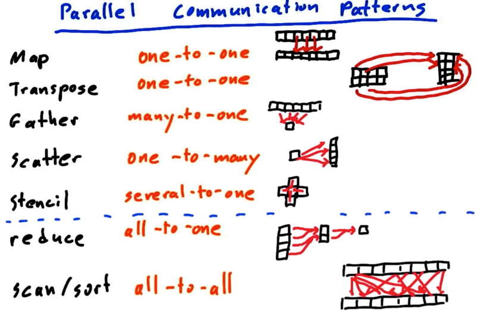
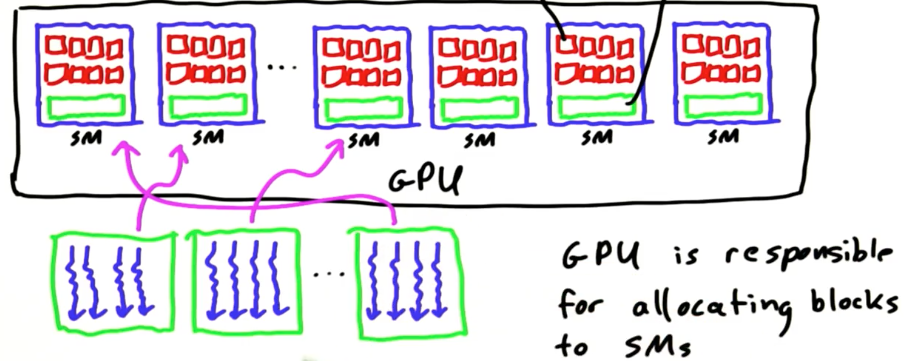
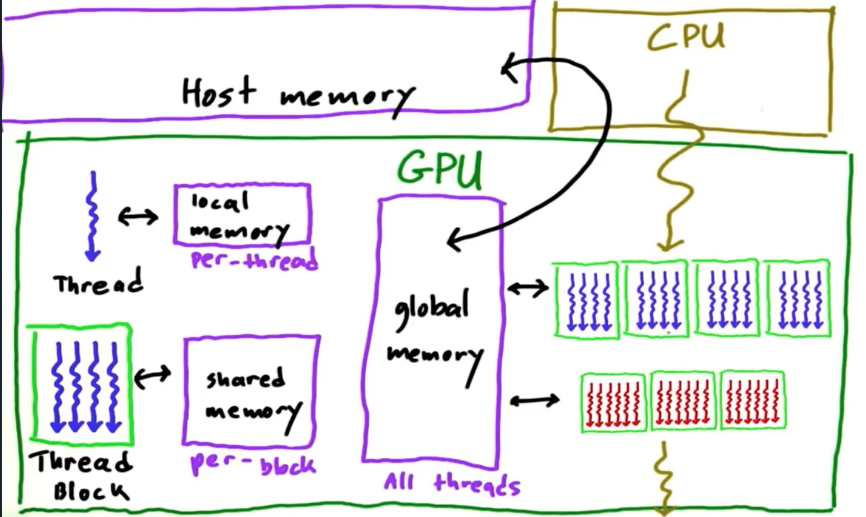
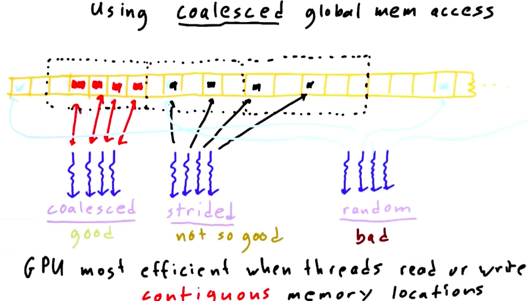

## Lesson 2 GPU Hardware and Parallel Communication Patterns

[TOC]

### Parallel communication patterns

1. __Map__: Task read from and write to specific data elements
2. __Gather__: Each calculation gathers input data elements together from different places to compute an output result
3. __Scatter__: Each parallel task needs to write its result in a different place or in multiple places
4. __Stencil__: Tasks read input from a fixed neighborhood in an array
5. __Transpose__: Tasks reorder data elements in memory
   1. AOS: Array of structures
   2. SOA: Structure of arrays

__Note__: Difference between __Stencil__ and __Gather__: __Stencil__ require tasks for all elements, while __Gather__ does not.

| Map        | Transpose  | Gather      | Scatter     | Stencil        | Reduce     | Scan/Sort  |
| ---------- | ---------- | ----------- | ----------- | -------------- | ---------- | ---------- |
| one-to-one | one-to-one | many-to-one | one-to-many | several-to-one | all-to-one | all-to-all |



### Thread Blocks and GPU Hardware

1. GPUs have __Streaming Multiprocessors__ (maybe 1, maybe 16), they run in parallel and independently
2. A __Streaming Processors__ have __simple processors__ and __memory__.
3. __GPU__ is responsible for allocating __thread blocks__ to __SM__s.
4. __Programmer__ only have to worry about giving the __GPU__ a big pile of __thread blocks__.



### Effieicent Strategies

1. High __Arithmetic__ Intensity
   - Arithmetric >> memory would be good
   - __Coalesce__ access to global memory
   - Use faster memories: __local__ > __shared__ > __global__ > __host__
2. Avoid __thread divergence__
   -  `if, else`
   - loop different times

### Memory Model

1. __local memory__ - in a thread
2. __shared memory__ - in a thread block
3. __global memory__ - in GPU
4. __host memory__ - in CPU



* Speed: __local__ > __shared__ >> __global__ >> __host memory__


#### Synchronization - Barrier

```cpp
__global__ void foo(){
  __shared__ int s[1024];
  int i = threadIdx.x;
  __syncthreads(); // A barrier, waiting for all threads to finish till this process
  int temp = s[i-1];
  __syncthreads(); // A barrier
  s[i] = temp;
  __syncthreads(); // A barrier
  printf(...)
}
```

#### Synchronization - Atomic

* A hardware method to ensure no collision
* Only certain operations, data types support
* Serialize access to memory, making it __SLOW__

```cpp
__global__ void increment_atomic(int *g){
  int i = threadIdx.x;
  i = i % ARRAY_SIZE;
  g[i] = g[i] + 1; // original, will collide
  atomicAdd(&g[i], 1); // atomic, sucess
}
```


#### Use global memory

* `__global__` or `__device__` to start a kernel
* We can only pass in local variables in a kernel, s.t. if we want to manipulate a global memory in a kernel, we have to __allocate and initialize global memory outside the kernel__.

  ```cpp
  __global__ void use_global_memory_GPU(float *array) {
    array[threadIdx.x] = 2.0f * (float) threadIdx.x;
  }
  int main() {
    float h_arr[128]; // a host memory (on CPU)

    float *d_arr; // a global(device) memory (on GPU)
    cudaMalloc( (void **)&d_arr, sizeof(float)*128 ); // we want to change the pointer of d_arr, s.t. we have to pass (void**)

    cudaMemcpy( (void*)d_arr, (void*)h_arr, sizeof(float)*128, cudaMemcpyHostToDevice ); // initialize
    use_global_memory_GPU<<1,128>>(d_arr);
    cudaMemcpy( (void*)h_arr, (void*)d_arr, sizeof(float)*128, cudaMemcpyDeviceToHost ); // copy back

  }
  ```

#### Use shared memory

* Use `__shared__`, `__shared__`variables are visible to all threads in the thread blocks

  ```cpp
  __global__ void use_shared_memory_GPU(float *array) {
    int i, index = threadIdx.x;
    float average, sum = 0.0f;

    __shared__ float sh_arr[128]; // declare a shared array
    sh_arr[index] = array[index]; // each thread would be doing their job

    __syncthreads(); // a barrier, ensure all shared memory have complete the operation.

    // Calc average of all previous elements
    for(i=0; i<index; i++) { sum += sh_arr[i]; }
    average = sum/(index+1.0f);

    if (array[index] > average) { array[index] = average; }

    sh_arr[index] = 3.14; // useless
  }
  ```

#### Coalesce access to global memory

* when accessing a global memory, GPU will also read some contiguous locations, s.t. a coalesced way of accessing would be good.
  
  ```cpp
  __global__ void use_shared_memory_GPU(float *array) {
    int index = threadIdx.x;
    int a = 3.14;

    // Coalesce access to global memory
    array[index] = a;
    a = array[index];
  }
  ```


