## Notes for CS344 on Udacity

__CS344: Intro to Parallel Programming__

Notes by [lzhbrian](http://lzhbrian.me)


[TOC]

## Lesson 1

### Index

```cpp
dim3 blockIdx // block index
dim3 blockDim // block dimensions (block size)
dim3 threadIdx // thread index in each block
```


## Lesson 2 GPU Hardware and Parallel Communication Patterns

### Parallel communication patterns

1. __Map__: Task read from and write to specific data elements
2. __Gather__: Each calculation gathers input data elements together from different places to compute an output result
3. __Scatter__: Each parallel task needs to write its result in a different place or in multiple places
4. __Stencil__: Tasks read input from a fixed neighborhood in an array
5. __Transpose__: Tasks reorder data elements in memory
   1. AOS: Array of structures
   2. SOA: Structure of arrays

__Note__: Difference between __Stencil__ and __Gather__: __Stencil__ require tasks for all elements, while __Gather__ does not.

| Map        | Transpose  | Gather      | Scatter     | Stencil        | Reduce     | Scan/Sort  |
| ---------- | ---------- | ----------- | ----------- | -------------- | ---------- | ---------- |
| one-to-one | one-to-one | many-to-one | one-to-many | several-to-one | all-to-one | all-to-all |


### Thread Blocks and GPU Hardware

1. GPUs have __Streaming Multiprocessors__ (maybe 1, maybe 16), they run in parallel and independently
2. A __Streaming Processors__ have __simple processors__ and __memory__.
3. __GPU__ is responsible for allocating __thread blocks__ to __SM__s.
4. __Programmer__ only have to worry about giving the __GPU__ a big pile of __thread blocks__.


### Effieicent Strategies

1. High __Arithmetic__ Intensity
   - Arithmetric >> memory would be good
   - __Coalesce__ access to global memory
   - Use faster memories: __local__ > __shared__ > __global__ > __host__
2. Avoid __thread divergence__
   -  `if, else`
   -  loop different times

### Memory Model

1. __local memory__ - in a thread
2. __shared memory__ - in a thread block
3. __global memory__ - in GPU
4. __host memory__ - in CPU


* Speed: __local__ > __shared__ >> __global__ >> __host memory__


#### Synchronization - Barrier

```cpp
__global__ void foo(){
  __shared__ int s[1024];
  int i = threadIdx.x;
  __syncthreads(); // A barrier, waiting for all threads to finish till this process
  int temp = s[i-1];
  __syncthreads(); // A barrier
  s[i] = temp;
  __syncthreads(); // A barrier
  printf(...)
}
```

#### Synchronization - Atomic

* A hardware method to ensure no collision
* Only certain operations, data types support
* Serialize access to memory, making it __SLOW__

```cpp
__global__ void increment_atomic(int *g){
  int i = threadIdx.x;
  i = i % ARRAY_SIZE;
  g[i] = g[i] + 1; // original, will collide
  atomicAdd(&g[i], 1); // atomic, sucess
}
```


#### Use global memory

* `__global__` or `__device__` to start a kernel
* We can only pass in local variables in a kernel, s.t. if we want to manipulate a global memory in a kernel, we have to __allocate and initialize global memory outside the kernel__.

  ```cpp
  __global__ void use_global_memory_GPU(float *array) {
    array[threadIdx.x] = 2.0f * (float) threadIdx.x;
  }
  int main() {
    float h_arr[128]; // a host memory (on CPU)

    float *d_arr; // a global(device) memory (on GPU)
    cudaMalloc( (void **)&d_arr, sizeof(float)*128 ); // we want to change the pointer of d_arr, s.t. we have to pass (void**)

    cudaMemcpy( (void*)d_arr, (void*)h_arr, sizeof(float)*128, cudaMemcpyHostToDevice ); // initialize
    use_global_memory_GPU<<1,128>>(d_arr);
    cudaMemcpy( (void*)h_arr, (void*)d_arr, sizeof(float)*128, cudaMemcpyDeviceToHost ); // copy back

  }
  ```

#### Use shared memory

* Use `__shared__`, `__shared__`variables are visible to all threads in the thread blocks

  ```cpp
  __global__ void use_shared_memory_GPU(float *array) {
    int i, index = threadIdx.x;
    float average, sum = 0.0f;

    __shared__ float sh_arr[128]; // declare a shared array
    sh_arr[index] = array[index]; // each thread would be doing their job

    __syncthreads(); // a barrier, ensure all shared memory have complete the operation.

    // Calc average of all previous elements
    for(i=0; i<index; i++) { sum += sh_arr[i]; }
    average = sum/(index+1.0f);

    if (array[index] > average) { array[index] = average; }

    sh_arr[index] = 3.14; // useless
  }
  ```

#### Coalesce access to global memory

* when accessing a global memory, GPU will also read some contiguous locations, s.t. a coalesced way of accessing would be good.
  
  ```cpp
  __global__ void use_shared_memory_GPU(float *array) {
    int index = threadIdx.x;
    int a = 3.14;

    // Coalesce access to global memory
    array[index] = a;
    a = array[index];
  }
  ```


## Lesson 3 Fundamental GPU Algorithms (Reduce, Scan, Histogram)

### Fundamental GPU Algorithms

* Reduce
* Scan
* Histogram

### Step and Work

* Step Complexity
* Work Complexity


### Reduce Algorithms

#### Serial Implementaion


#### Parallel Reduce

* Step Complexity: log2(n)


```cpp
// Use Global Memory
__global__ void global_reduce_kernel(float*d_out, float*d_in)
{
  int myId = threadIdx.x + blockDim.x*blockIdx.x;
  int tid = threadIdx.x;
  
  // do reduction in global mem
  for(unsigned int s = blockDim.x/2; s>0; s>>=1)
  {
    if(tid<s)
    {
      d_in[myId] += d_in[myId+s];
    }
    __syncthreads();
  }
  
  // only thread 0 writes result for this block back to global mem
  if(tid==0)
  {
    d_out[blockIdx.x] = d_in[myId];
  }
}
```

```cpp
// Use Shared Memory
__global__ void shmem_reduce_kernel(float*d_out, const float*d_in)
{
  // sdata is allocated in the kernel call: 3rd arg to <<<b, t, shmem>>>
  extern __shared__ float sdata[];
  
  int myId = threadIdx.x + blockDim.x*blockIdx.x;
  int tid = threadIdx.x;
  
  // load shared mem from global mem
  sdata[tid] = d_in[myId];
  __syncthreads();
  
  // do reduction in shared mem
  for(unsigned int s = blockDim.x/2; s>0; s>>=1)
  {
    if(tid<s)
    {
      sdata[myId] += sdata[myId+s];
    }
    __syncthreads();
  }
  
}
```

```cpp
// main reduce program
void reduce(float * d_out, float * d_intermediate, float * d_in, 
            int size, bool usesSharedMemory)
{
    // assumes that size is not greater than maxThreadsPerBlock^2
    // and that size is a multiple of maxThreadsPerBlock
    const int maxThreadsPerBlock = 1024;
    int threads = maxThreadsPerBlock;
    int blocks = size / maxThreadsPerBlock;
    if (usesSharedMemory)
    {
        shmem_reduce_kernel<<<blocks, threads, threads * sizeof(float)>>>
            (d_intermediate, d_in);
    }
    else
    {
        global_reduce_kernel<<<blocks, threads>>>
            (d_intermediate, d_in);
    }
    // now we're down to one block left, so reduce it
    threads = blocks; // launch one thread for each block in prev step
    blocks = 1;
    if (usesSharedMemory)
    {
        shmem_reduce_kernel<<<blocks, threads, threads * sizeof(float)>>>
            (d_out, d_intermediate);
    }
    else
    {
        global_reduce_kernel<<<blocks, threads>>>
            (d_out, d_intermediate);
    }
}
```

​

### Scan Algorithms

| Algorithm     | Scan type      | Work E | Step E |
| ------------- | -------------- | ------ | ------ |
| Serial        |                | n^2    | logn   |
| Hillis/Steele | inclusive scan | nlogn  | logn   |
| Blelloch      | exclusive scan | 2n     | 2*logn |


### Histogram Algorithms

#### Accumulate using atomics

```cpp
__global__ void simple_histo(int *d_bins, const int *d_in, const int BIN_COUNT)
{
    int myId = threadIdx.x + blockDim.x * blockIdx.x;
    int myItem = d_in[myId];
    int myBin = myItem % BIN_COUNT;
    atomicAdd(&(d_bins[myBin]), 1);
}
```
#### Per thread Histogram, then reduce

* Each threads responsible for some data


#### Sort then reduct by key


## Lesson 4 Fundamental GPU Algorithms (Applications of Sort and Scan)

### Compact

#### First compact, then compute

* We want to __first compact__ then __compute__ if the computation load is very heavy.

  

  ​

#### Steps to Compact

1. __Predicate__ True:1, False:0

2. __Exclusive-sum-scan__
   * __Output__ is __Scatter Addresses__ for __Compacted Array__

3. Scatter input into output using __Scatter Addresses__

   

### Segment Scan


### Sparse Matrix

#### CSR Format

1. Value

2. Column

3. Row Pointer

   

#### Multiplication method for sparse Matrix 

1. Create __segmented representation__, using __value__ and __rowpointer__

2. Gather vector value using __column__

3. Multiply

4. __Segmented-sum-scan__

   

### Sort Algorithms

#### Brick Sort (Odd-Even Sort)

* Step: n

* Work: n^2

  

#### Merge Sort

* Divide and Conquer

* Step: logn

* Work: nlogn

  

##### 3 stages

1. __Stage 1__
   * lots of small tasks
   * Use a __Serial Algorithm__, one thread per merge
   * Another Sol: It is common that __at the start of a large merge sort__ to first sort like 1024 elements and __start the merge sort with sorted chunks of size 1024__
     * Using a __shared memory__ to read and write many elements at the same time could have better performance
2. __Stage 2__
   * bunch of medium tasks
   * Could use a __Serial Algorithm__
   * Better use a __Parallel Algorithm__, one block per merge (one thread per element)
3. __Stage 3__
   * One Big Task (which is bad to have, because only one SM would be working, other lots of SMs would be Idle)
   * ​

##### Merge Algorithm

1. __Serial Algorithm__

   * compare each element from two array and output smaller(bigger)

   

2. __Parallel Algorithm__

   * 1 thread per input element in each of the 2 sorted list
   * 1 block (SM) per merge 
   * __Scatter Address__ = __index_in_original_seq__ + __index_will_be_in_another_seq__

   

3. __Breaking up a single Big Merge__

   * Split the two seq into __smaller subset__ (say 256 elements per subset)
   * Get the __Splitters__ (A,B,C,D,… ; E,F,G,H,...)
   * __Per SM__ : Sort the list between the two splitters

   

#### Oblivious, Bitonic Algorithm

* Any Input require __the same amout of time__ to sort

* Step: (logn)^2 / 2， work per step: n/2

* Works: n(logn)^2 / 4

* A general sort problem is to merge two array

  * Sort each half and reverse the 2nd half, append it to the 1st half to get a __Bitonic Array__
  * Cross and compare the 1st half and the 2nd half to generate __two Bitonic Array__
  * __Recursion__ till sorted

* Note that every step can be computed __parallel__

  

#### Radix Sort

* Works: __k__*__n__

  * __k__: bits in representation
  * __n__: items to sort

* Steps:

  1. Start with LSB (Least Significant Bit)
  2. Split input into 2 sets based on Bit, otherwise preserve order
  3. Move to next MSB, Repeat

* GPU:

  * Compact
    * Predicate rule: (i&1) == 0
    * Scan to get the Scatter Address
  * Faster
    * Taking __multiple bits per class__
    * __4-bits per pass__ -> a __16-way split__ is common

  


#### Quick Sort

* Steps:

  1. Choose pivot element
  2. Compare all elements __v.s. pivot__
  3. Split into 3 arrays: \<p =p \>p
  4. Recurse on each array

* Idea:

  * Segment

  

#### Key Sort

* Idea
  * if the value is large, use a pointer (point the actual value) in instead
  * Move the key-value as a unit
    * 64 bits = 32-bits-key + 32-bits-value


## Lesson 5 Optimizing GPU programming

### Some concepts

#### Levels of Optimaization

1. Picking good algorithms

2. Basic principls for efficiency

3. Architecture-specific detailed optimization

4. Micro-optimization (Instruction Level)

   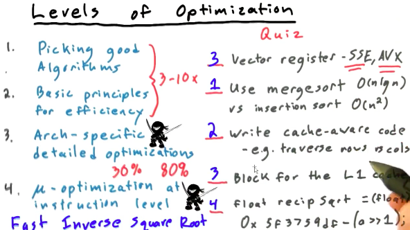

#### GPU Optimization method

1. Fundamentally parallel

2. Memory opt

   1. Coalescingglobal memory
   2. use shared memory

3. Arch

   1. bank conflicts
   2. optmizing registers

4. Micro-opt

   1. floating-point
   2. denorm hacks

   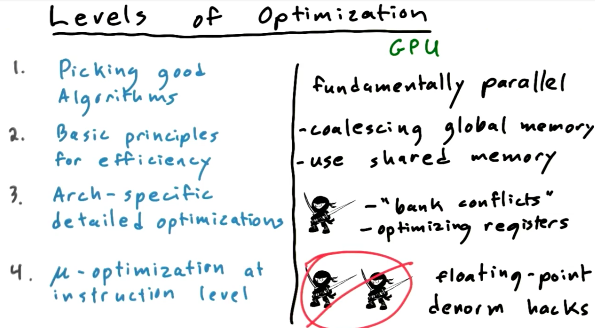

#### Principals of effiecient GPU programming

1. Maximize arithmetic intensity
2. Decrease time spent on memory operations
3. Coalesce global memory accesses
4. Avoid thread divergence

### APOD - Systematic Optimization - a cycle

* __Analyze__: Profile whole application
* __Parallelize__: Pick an approach, pick an algorithm
* __Optimize__: Profile-driven optimization
* __Deploy__: Don't optimize in a vacuum


### Optimizing Memory Operations

#### Bandwidth

##### Theoretical v.s. Real

* 40-60%: Okay
* 60-75%: Good
* \>75%: Excellent

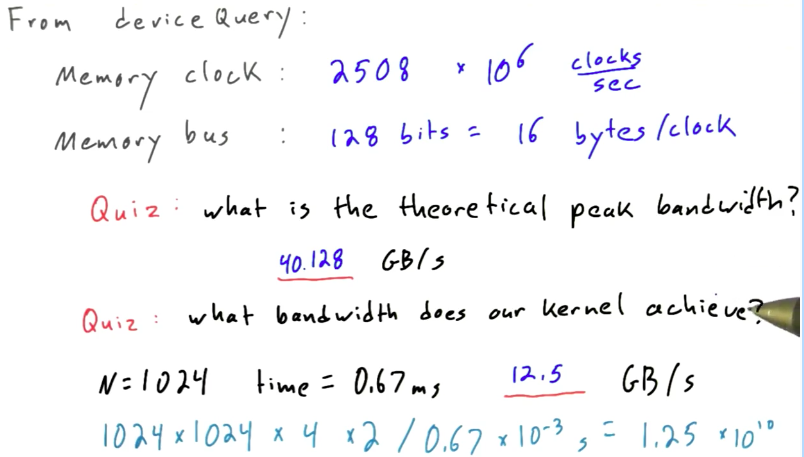


#### Analyze

##### Understand Hotspots

* Don't rely on intuition, run a profiler
   1. gprof
   2. vtune
   3. verySleepy
* Amdahl's Law
   * Total speedup from paralelization is limited by portion of time spent doing some thing to be parallelized
* Parallelize


##### Understanding Strong scaling v.s. Weak Scaling

- __Weak scaling__: means that the size of the problem does not highly correlated to the run time
  - Strategy: run a larger problem
- __Strong Scaling__: means that the larger the problem is, more time is required
  - Strategy: run a problem faster


#### NVVP to Profile our Run

##### Solving write global not coalescing issue

```cpp
__global__ void 
transpose_parallel_per_element_tiled(float in[], float out[])
{
	// TODO
	// (i,j) locations of the tile corners for input & output matrices:
	int in_corner_i  = blockIdx.x * K;
	int in_corner_j  = blockIdx.y * K;
	int out_corner_i = blockIdx.y * K;
	int out_corner_j = blockIdx.x * K;

	
	int x = threadIdx.x;
	int y = threadIdx.y;


	__shared__ float tile[K][K];


	// coalesced read from global mem, TRANSPOSED write into shared mem:
	tile[y][x] = in[(in_corner_i + x) + (in_corner_j + y)*N];
	__syncthreads();
	
	
	// read from shared mem, coalesced write to global mem:
	out[(out_corner_i + x) + (out_corner_j + y)*N] = tile[x][y];
}
```

#### Little's Law

\# of Bytes delivered = Average Latency of Each Transaction * bandwidth 


#### Occupancy

##### Definition

* Occupancy = Threads running / Max threads possible


* Each SM has a limited number of:
  * thread blocks
  * threads
  * registers
  * bytes of shared memory

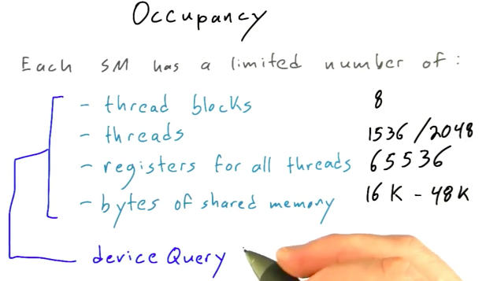

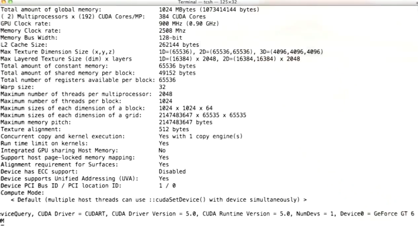

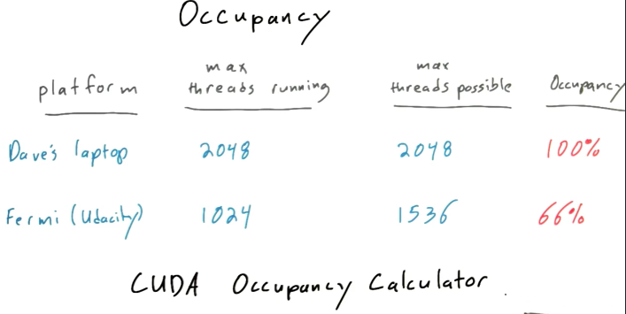

##### How to affect occupancy

1. Control amount of shared memory (e.g. tile size)
2. Change \# of threads, blocks (<<<,>>>)
3. Compilation options to control register usage

* Note: Increasing occupancy usually helps, but only to a point
  * __Pros__: Exposes more parallelism, transactions in flight
  * __Cons__: May force GPU to run less efficiently


### Optimizing Compute Performance

* Goal: Maximiaze useful computation per second
  * Minimize time waiting at barriers (See above)
  * Minimize thread divergence

#### Minimizing thread divergence

* __Warp__: a set of threads that execute the same instruction at a time

  * 32 threads per warp

* __SIMD__: Single Instruction, Multiple Data

  * On CPU: SSE/AVX (vector registers)

* __SIMT__: Single Instruction, Multiple Thread

* __Thread Divergence__

  * only 32 threads in a warp, so the max penalty for a CUDA thread divergence is 32x slowdown. (When all threads in a warp diverge)

  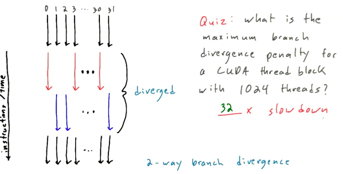


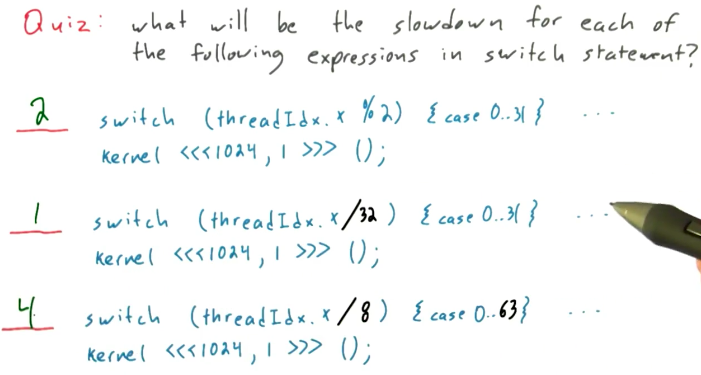

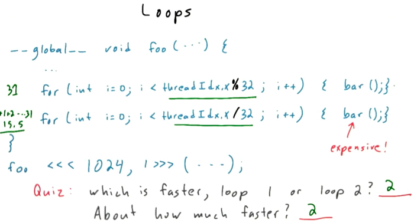

* Reducing branch divergence
  * Avoid branchy code
  * Beware large imbalance in thread workloads


#### Assorted Math Optimizations

* Use double precision only when you mean it

  * ```cpp
    3.14 != 3.14f
    ```

* use __intrinsics__ when possible

  * ```cpp
    __sin(), __cos(), ...
    ```

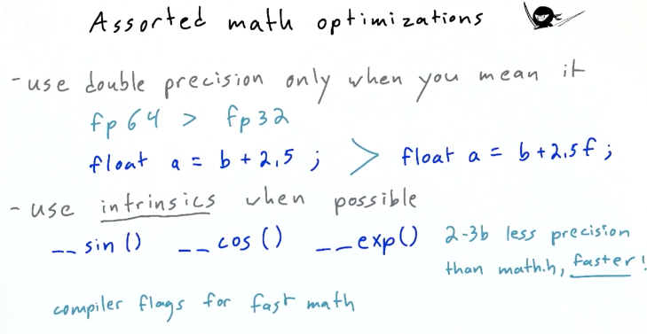


### Host-GPU Interaction

* ```cpp
  cudaHostMalloc()
  ```

* ```cpp
  cudaHostRegister()
  ```


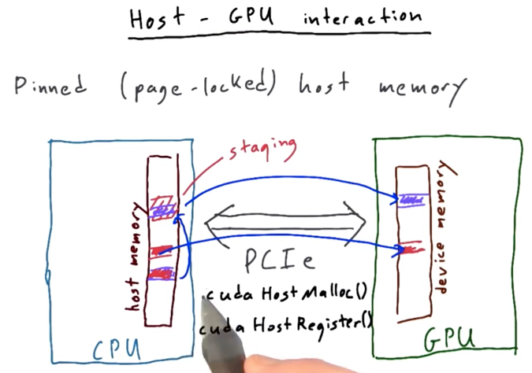


#### Streams

```cpp
cudaStream_t s1;
cudaStreamCreate(&s1);
cudaStreamDestroy(s1);
cudaMemcpyAsync()
```

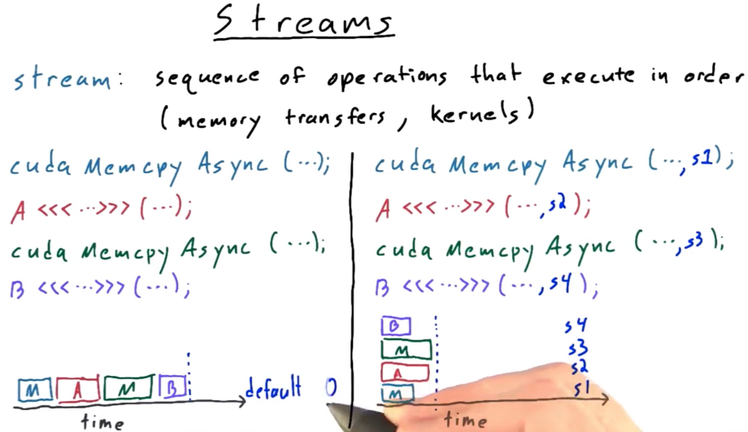


* If we want to process some very big data, we can make the data transfer process do when the GPU is also computing.

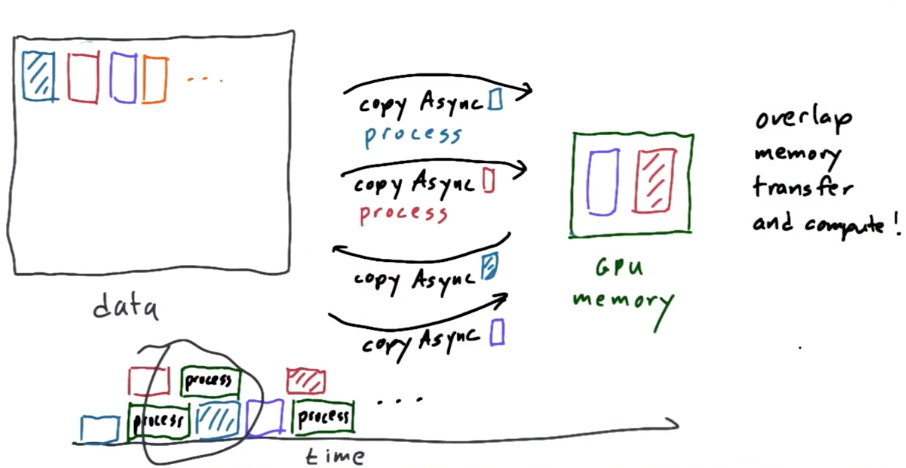

#### Advantages of Streams

1. Overlap memory & Compute
2. Help fill GPU with small kernels
   1. Many problems with limited parallelism
   2. Computations with narrow phases (reduce)

#### More

1. Check CUDA programming Guide
   1. Streams
   2. Events


## Lesson 6 Parallel Computing Patterns

### N-Body Problem

* Complecity: n^2
* ​


## Lesson 7 Additional Parallel Computing Topics and Dynamic Parallelism


